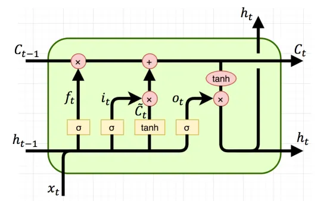
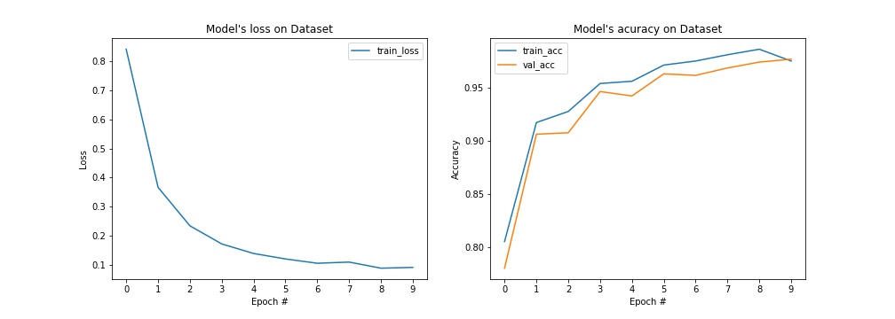

# Báo cáo cuối kỳ Xử lý tiếng nói   **Trò chơi rắn săn mồi điều khiển bằng giọng nói**

## Nhóm 13
- Nguyễn Quốc Khánh - 18020685
- Nguyễn Văn Khiêm - 18020715
- Lê Kim Long - 18020852
- Tần Lê Nghĩa - 18020949

## Tổng quan

Trò chơi rắn săn mồi chắc chắn đã quá quen thuộc với chúng ta rồi, vì vậy nhóm em thấy không cần phải giới thiệu thêm nữa. Chủ đề mà nhóm em chọn vẫn là trò chơi rất phổ biến này, nhưng lần này chú rắn sẽ có khả năng nghe hiểu tiếng nói để di chuyển theo ý người chơi!  

Trò chơi gồm 2 phần: phần *trò chơi* và phần *điều khiển*. Phần trò chơi là trò rắn săn mồi quen thuộc được viết bằng thư viện *pygame*. Phần điều khiển chứa mô hình nhận diện âm thanh giúp chuyển trực tiếp lời nói thành lệnh điều khiển phần *trò chơi*. Khi chơi, người chơi sẽ cần phải nhấn phím bất kỳ để ra lệnh. Phần điều khiển sẽ tiến hành ghi âm, xử lý, nhận diện và đưa ra khẩu lệnh tương ứng. Báo cáo này sẽ tập trung nhiều đến phần điều khiển, cụ thể là mô hình nhận diện được sử dụng.

Dựa trên đo đạc thời gian thực thi trong Jupyter notebook, nhóm xác định độ trễ kể từ khi ghi âm xong đến khi cho ra kết quả là khoảng 0.103s giây. Trong đó thời gian để xử lý, trích xuất đặc trưng mất ~0.11 giây, thời gian nhận diện ~0.02 giây. Đây là một độ trễ khá tốt vì nhóm đã tìm nhiều cách để giảm thời gian này xuống, bao gồm biến đổi trực tiếp trên âm thanh đang ghi; cùng một số thủ thuật nhỏ như gộp kênh âm thanh, giảm tần số lấy mẫu,  v.v...

## Mô hình nhận diện

Mô hình được sử dụng đển nhận diện là Long Short-term Memory (LSTM). LSTM là mạng trí nhớ ngắn hạn định hướng dài hạn đã được giới thiệu bởi Hochreiter và Schmidhuber năm 1997. Mô hình này được sử dụng rộng rãi đến ngày nay do nó khắc phục được vấn đề tiêu biến (vanishing gradient) cũng như bùng nổ đạo hàm (exploding gradient) trên các mô hình hồi quy RNN truyền thống. Sự "khéo léo" của LSTM nằm ở việc mỗi một khối LSTM sẽ có thêm một phần bộ nhớ (cell state) giúp lưu trữ thông tin dài hạn. Thông tin này được tính toán kết hợp từ 3 loại cổng gồm cổng quên, cổng vào, cổng ra để quản lý các thông tin tại mỗi nút.

Sơ đồ của một khối LSTM được thể hiện ở hình trên. Một cách ngắn gọn:

* Cổng vào $i_t$ quyết định bao nhiêu lượng thông tin đầu vào sẽ ảnh hưởng đến trạng thái mới.
* Cổng quên $f_t$ quyết định sẽ bỏ đi bao nhiêu lượng thông tin đến từ trạng thái trước đó.
* Cổng ra $o_t$ điều chỉnh lượng thông tin có thể ra ngoài và lượng thông tin truyền tới trạng thái tiếp theo.
* $h_t$, $c_t$, $x_t$ lần lượt là trạng thái ẩn (hidden state), cell state và đầu vào tại thời điểm $t$. $C_t$ đóng vai trò là bộ nhớ dài hạn, $h_t$ là phần bộ nhớ ngắn hạn trong khối. $C_t$ và $h_t$ có thể được sử dụng để lan truyền tới khối LSTM tiếp theo.

### Kiến trúc mô hình

Mô hình dùng để huấn luyện bao gồm 1 lớp LSTM và 1 lớp Fully Connected.

### Các tham số

* Số khối LSTM nối tiếp nhau trong lớp LSTM: $num\\_layer=3$.
* Các đoạn âm thanh có số chiều khác nhau, do đó $batch\\_size$ bằng $1$.
* Kích thước của hidden state và cell state: $hidden\\_size=64$. Như vậy shape của $h_t$ và $C_t$ là $3,1,64$, lần lượt là $num\\_layer$, $batch\\_size$ và $hidden\\_size$
* Kích thước dữ liệu đầu vào: $\[1, l, 20\]$. Trong đó $l=\frac{audiolen\*sr}{hop}=\frac{audiolen\*22050}{512}$; $20$ là số hệ số MFCC.
* Đầu ra có shape $[1, l, 64]$.
* Đầu ra này sau đó được lan truyền tới lớp FC dùng để phân loại. Lớp FC có số đặc trưng đầu vào là 64 do chúng mang thông tin của các thời điểm trước, chỉ cần thực hiện decode tại thời điểm cuối cùng của chuỗi đầu ra LSTM. Số lớp đầu ra của FC là 4 tương ứng số lượng khẩu lệnh cần nhận diện: lên, xuống, trái, phải.

### Dữ liệu và tăng cường dữ liệu

Tổng cộng 3467 mẫu âm thanh lấy ngẫu nhiên từ các bạn trong lớp. 80% được dùng để huấn luyện, 20% còn lại nằm trong tập test. Dữ liệu gồm 4 nhãn: lên, xuống, trái, phải.

Một số phương pháp augmentation được sử dụng dựa trên các vấn đề mà nhóm phân tích và chỉ ra được:

* Dịch trong miền thời gian. Âm thanh huấn luyện được cắt khá sát với khẩu lệnh, trong khi âm thanh thu thực tế thường nằm lệch về nửa sau của đoạn ghi âm. Dịch thời gian giúp mô hình bớt nhạy cảm với thời điểm phát âm khẩu lệnh hơn.
* Zero padding. Thay một phần đầu và cuối thành khoảng lặng, giúp mô hình nhận diện các trường hợp phát âm quá sớm hoặc quá muộn, một phần khẩu lệnh bị mất.
* Thêm nhiễu. Nhóm có một số đoạn ghi âm nhiễu của các họat động thường ngày. Nhiễu này sẽ được cộng ngẫu nhiên với âm thanh huấn luyện. Quá trình này giúp mô hình bớt nhạy cảm với nhiễu hơn.
* Khuếch đại biên độ. Nhân âm thanh trong miền thời gian với một số ngẫu nhiên nhằm tăng/giảm biên độ âm, giúp giảm sự phụ thuộc vào âm lượng.

### Quá trình huấn luyện

* Thuật toán tối ưu tham số: Adam.
* Số epoch: 10 (cần khoảng 70s cho mỗi epoch).
* Dừng sớm (Early stopping) dựa vào validation accuracy.
* lr = 1e-4
* Hàm mất mát: CrossEntropy.
* batch_size : 1 (do số chiều đặc trưng của mỗi đoạn âm là khác nhau).
* Huấn luyện có CUDA trên Google Colab Tesla T4.

### Kết quả thu được

Độ chính xác thu được khoảng 97.6% sau 9 epoch. Thời gian nhận diện mẫu chỉ khoảng 0.02 giây, có biến động nhẹ theo độ dài mẫu.

Bộ trọng số sau huấn luyện được xuất ra file [ver2.pth](ver2.pth) để dùng cho nhận diện.

## Trò rắn săn mồi

Phần này nhóm em xin được trình bày ngắn gọn vì viết trò chơi không phải là chủ đề chính của bài báo cáo này. Mã nguồn của trò chơi được tham khảo từ [GeeksforGeeks](https://www.geeksforgeeks.org/snake-game-in-python-using-pygame-module/). Nhóm đã phải viết lại dựa trên code có sẵn để phù hợp cho chạy song song. Lý do bởi *pygame* không tối ưu cho đa luồng, nói cách khác: *pygame* không [*thread safe*](https://en.wikipedia.org/wiki/Thread_safety). Ngoài ra nhóm cũng chỉnh sửa một số chi tiết về logic và kích thước của mồi để phù hợp cho việc điều khiển bằng giọng nói, vốn không thể nhanh và chính xác như dùng nút bấm thông thường.

## Các vấn đề gặp phải trong quá trình thực hiện

1. Ban đầu nhóm em dự định làm nhận diện khẩu lệnh liên tục bằng cách phân vùng giọng nói ngay trong khi ghi, sau đó gửi mẫu giọng nói được phân vùng cho bên nhận diện. Nhóm đã thử nhiều cách bao gồm dùng mô hình nhận diện vùng có tiếng nói, dùng FFT để tính cường độ âm và coi những vùng có cường độ lớn hơn một ngường nào đó là vùng có giọng nói nhưng không thành công. Vì vậy nhóm em phải sử dụng nhấn để nói.
1. Âm thanh để train rất ngắn và sát khẩu lệnh, hầu hết được ghi trong môi trường yên tĩnh. Trong khi âm thanh thu ngoài thực tế chứa nhiều tiếng ồn, ngoài ra thời điểm phát âm thường xuyên rơi vào nửa sau của đoạn ghi, một số còn bị ngắt giữa chừng. Điều này gây rất nhiều khó khăn cho việc nhận diện. Do đó nhóm đã thực hiện các kỹ thuật augment dữ liệu phù hợp để mô hình có thể chủ động xử lý các tình huống này.
1. Riêng về vấn đề khoảng lặng, nhóm không thực hiện augment thêm khoảng lặng ở dữ liệu huấn luyện vì chi phí rất tốn kém và không hiệu quả. Thay vào đó khi gặp các đoạn ghi thực tế có khoảng lặng dài, nhóm đã chủ động xử lý trực tiếp ngay khi ghi bằng cách bỏ đi các đoạn có cường độ âm nhỏ hơn một ngưỡng cho trước. Cách này khiến thời gian xử lý khi nhận diện tăng rất nhẹ nhưng bù lại giảm nhiều công sức augment dữ liệu. Nhóm em nghĩ đây là sự đánh đổi hợp lý.

## Kết quả, kết luận

Video minh họa kết quả có tại [đây](https://youtu.be/3x6s9VgrCcg).

Dựa vào kết quả từ thực tế, nhóm em rút ra nhận xét như sau:

* Độ chính xác thực tế khi nhận diện chỉ đạt khoảng 80-90% (so với 97.6% trên tập test). Tỷ lệ này biến động nhiều theo độ yên tĩnh và độ nhiễu của môi trường. Có lẽ việc augment thêm nhiễu vào dữ liệu huấn luyện chưa thật sự đúng. Trong video minh họa số lần nhận diện đúng/tổng là 14/16 ~ 87.5%, môi trường quay video ồn nhẹ do tiếng quạt gió.

* Khẩu lệnh "trái" thường xuyên sai hơn. Nhóm em đã thử phát âm nhiều lần và nhận thấy nếu phát âm "trái" nhanh và cao thì xác suất đúng sẽ tăng lên rất nhiều, trong khi nếu hạ thấp tông giọng sẽ cho kết quả rất tệ. Điều này cũng ít nhiều xảy ra với 3 khẩu lệnh còn lại. Có lẽ điều này đến từ việc nhóm em chưa nghĩ đến việc dùng time-stretch và pitch-shift để augment, dẫn đến việc mô hình khá nhạy cảm với cao độ và tốc độ phát âm.

## Lưu ý cài đặt

Dự án sử dụng thư viện *pynput* để bắt sự kiện bàn phím. Điều này khiến cho file *ran.py* có thể bị nhận diện là KeyLogger bởi phần mềm diệt virus. Để chạy, cần thêm ngoại lệ cho *ran.py*.
